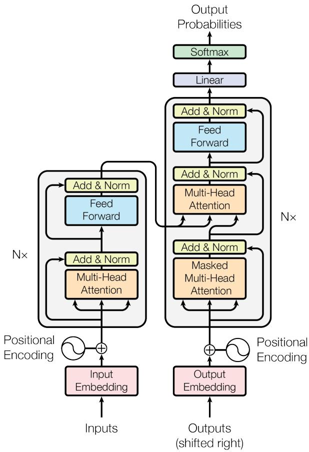

# 改变AI历史的一篇论文：Transformer凭什么成为深度学习基石？

如果你用过ChatGPT、Gemini或任何一个现代大模型，你其实已经在用这篇论文的成果了——但你可能从没读过它。

2017年，谷歌研究员做了一个「激进」的决定：把翻译模型里的循环结构全删掉。结果不仅没崩，性能反而更好了。这篇论文就是《Attention Is All You Need》，提出的架构叫 Transformer。

它要解决的核心问题是：传统 RNN 必须一步一步顺序处理文字，没法并行，训练慢、长距离依赖也容易丢失。Transformer 用自注意力机制一次性看完整个句子，彻底绕开了这个瓶颈。

✨ 核心亮点

🚀 完全并行化训练
RNN 训练一个翻译模型可能要几周，Transformer 在 8 块 GPU 上跑 3.5 天就能达到 SOTA，某些配置 12 小时就够了。

🔍 多头注意力机制
模型同时从多个角度捕捉词与词之间的关系，不管两个词距离多远，注意力一步到位，不再「记性差」。

📈 性能直接炸裂
英德翻译 BLEU 达到 28.4，不只超过所有单模型，连集成模型都打败了，整整高出 2 个点以上。英法翻译单模型 BLEU 41.8，同样刷新 SOTA。

🔄 架构通用性极强
除了机器翻译，直接迁移到句法分析任务也刷新了 SOTA——这不是为翻译定制的特化设计，是一套通用框架。

💡 对你有什么用？

BERT、GPT、LLaMA、T5……所有你听过的主流大模型，底层架构都源自这篇论文。读懂 Transformer，是理解现代 AI 的真正起点。而且多头注意力的可视化分析方法，现在已经是 NLP 可解释性研究的标准工具，做模型分析的同学可以直接用。

你现在用的 AI 产品，背后都站着这篇 2017 年的论文。有没有哪个应用场景让你觉得「原来注意力机制在这里发挥了作用」？欢迎评论区聊聊 👇

#Transformer #深度学习 #NLP #大模型 #机器翻译 #AI论文精读 #自注意力机制 #炼丹笔记 #ChatGPT #BERT